# MGS Tone Craft

MGS Tone Craft（MGSTC）は、MGSDRV向けの音色エディタです。
PSG（YM2149）、SCC、OPLL（YM2413）の音色を編集・試聴し、
MGSCで使える定義テキストの作成を支援します。

本ソフトウェアは、[OpenAI Codex](https://openai.com/codex/) と
[Cursor](https://cursor.com/) によるバイブコーディング（対話的なAI支援開発）で作成しています。

**現状は Alpha（機能限定の公開）です。** 仕様や操作性は今後変わることがあります。Alpha ではバージョン間のアップグレード互換（設定 INI・音色ライブラリ・複合保存などの移行）は保証しません。互換の維持は Beta 以降で開始します。

### 総合画面

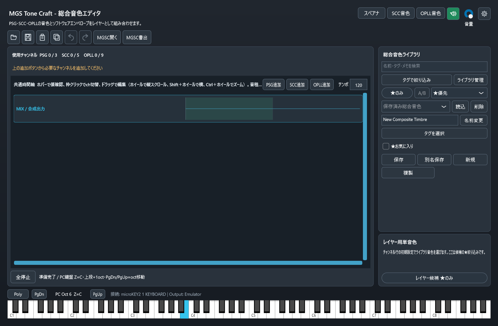

※画面は開発中のものです

### リアルタイムスペクトログラム／スペクトラム

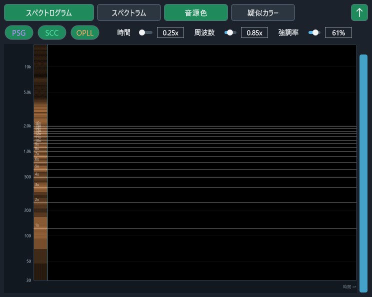

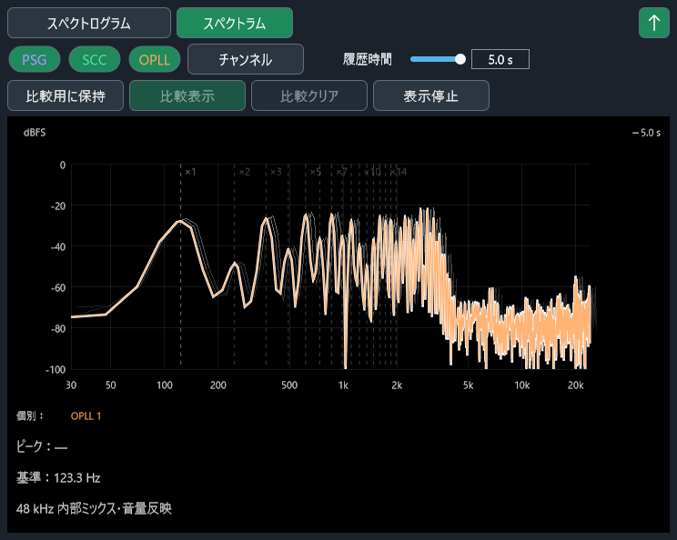

総合／SCC／OPLLから同じ共有窓を開きます。スペクトログラムとスペクトラムを切り替えられ、音源色／疑似カラー、履歴、比較保持に対応します。窓の操作中も、直前のエディタへPCキー／MIDI入力を渡せます。

※画面は開発中のものです

### OPLL 音色エディタ

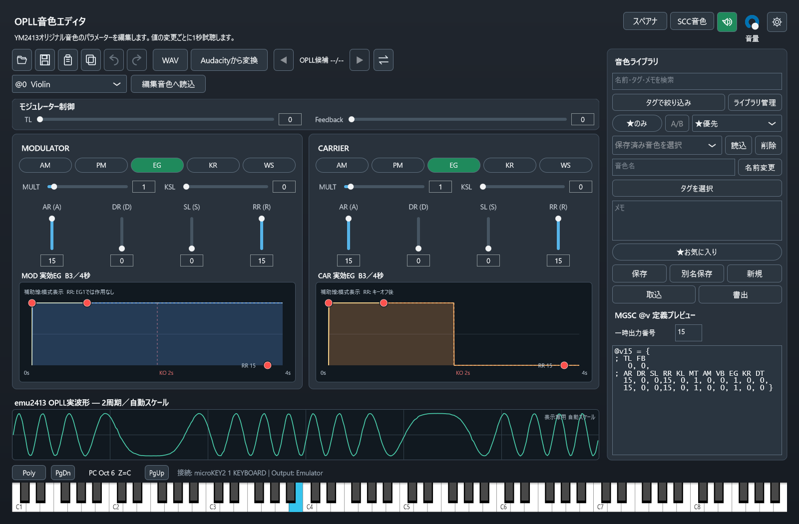

※画面は開発中のものです

### SCC 音色エディタ

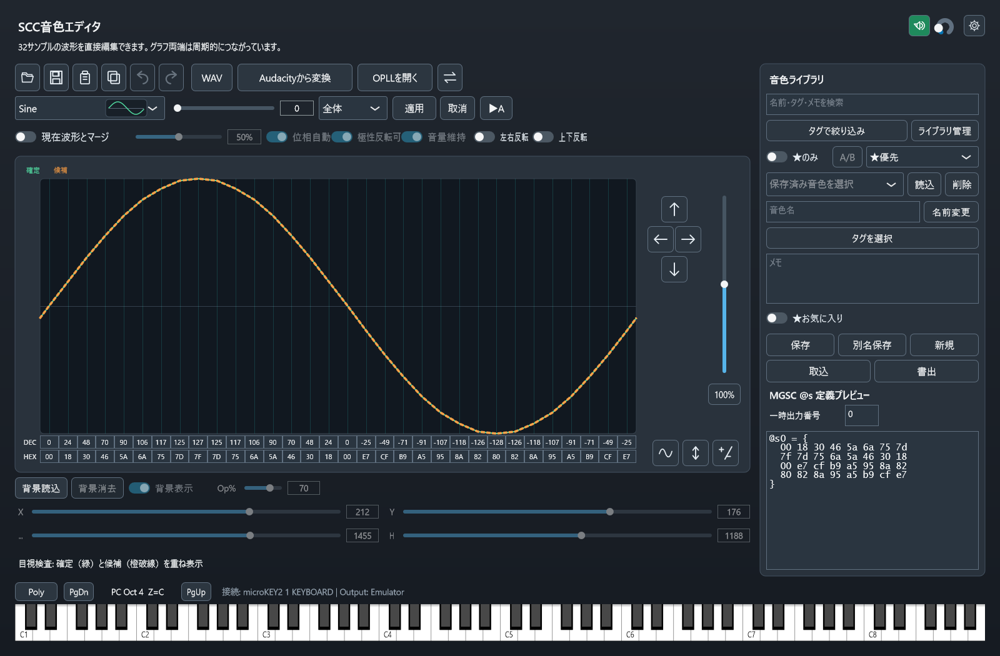

※画面は開発中のものです

### アプリ設定（View / MIDI / Output）

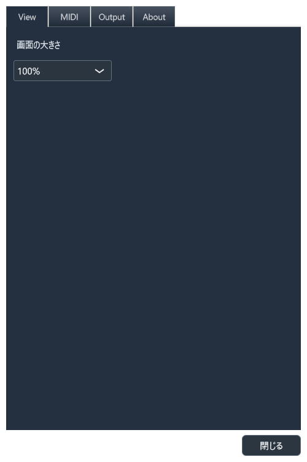

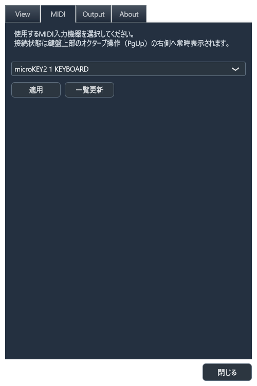

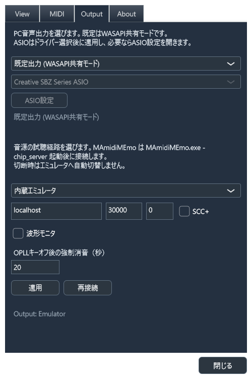

※画面は開発中のものです

### 音色ライブラリ管理

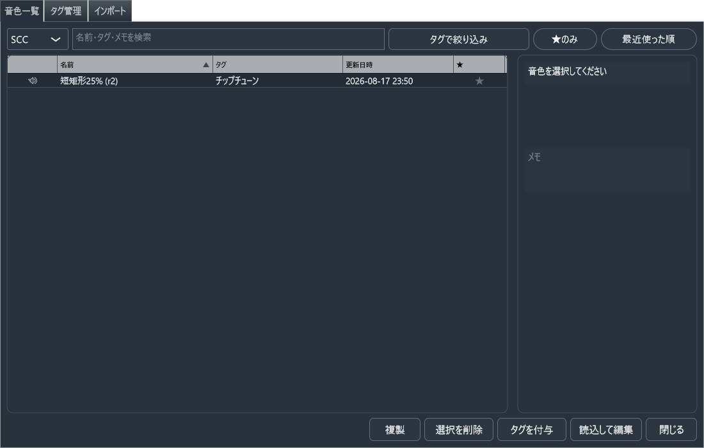

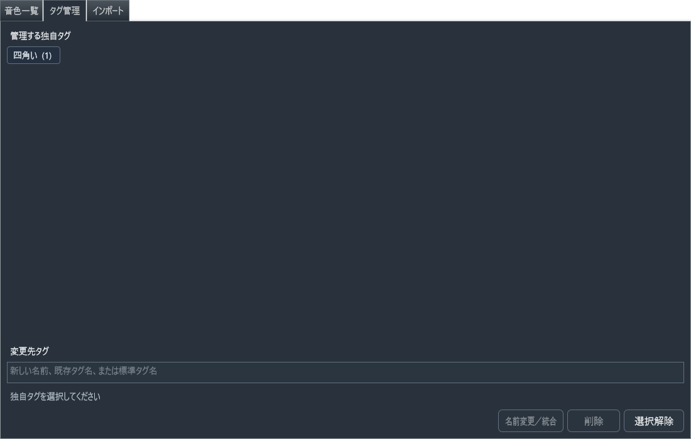

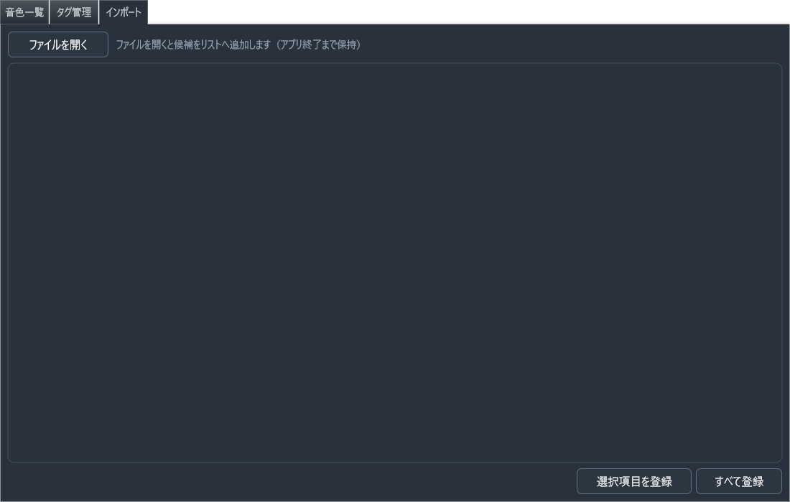

※画面は開発中のものです

## Alpha でできること（概要）

- **総合音色**: PSG／SCC／OPLLチャンネルを共通時間軸で重ね、音量・音程・休符・`@e`／`@r`・LFO（`h`）などを編集。開く／保存／コピー／貼り付け、MGSCソースのプレビュー
- **SCC単音色**: 32サンプル波形の編集、プリセット／マージ、タグ付きライブラリ保存、`@s`定義の確認・入出力
- **OPLL単音色**: MOD／CARパラメーター編集、EG補助操作、タグ付きライブラリ保存、`@v`定義の確認・入出力
- **スペアナ**: 総合／SCC／OPLLから開く共有窓。スペクトログラムとスペクトラム、音源別表示、強調率、履歴と比較
- **タグ検索・管理**: 78種類の標準タグと独自タグを複数設定し、複数タグのAND条件またはタグだけで絞り込み。独自タグは全ライブラリを対象に名前変更・統合・削除
- **ライブラリ管理**: モデルレス独立窓。★お気に入り、並べ替え、名前変更・参照安全な削除、選択時試聴とA/B比較。変更は開いている各エディタ一覧へ即時反映
- **インポート**: 非圧縮MGS、MML／MUS、MuSICA VCD、SCC-Musixx SNG、VGM／VGZの完成したOPLL／SCC／総合音色を候補化し、既存ライブラリへ登録（圧縮MGSは拒否。`.mgstc`取込は別操作のまま）
- **複合音色との連携**: 割当済みSCC／OPLL音色を対応エディタで開き、総合出音を聴きながら編集・保存反映
- **試聴**: 画面鍵盤、PCキーボード、MIDI入力、内蔵エミュレータ。1秒プレビューON／OFF。スペアナ操作中も直前エディタへ鍵盤入力を委譲
- **VST3 Instrument**（Stage B）: DAW から 48 kHz で Note On／Off を受け、既定の総合音色を stereo で返す。エディタ・プリセット・任意サンプルレートは未対応。ビルド成果物の置き場は [BUILDING.md](BUILDING.md) を参照
- **実機演奏**: MAmi-VSIF dongle／MAmidiMEmo 経由で MSX 実機へ出力して発音できる
- **変換**: WAV／Audacityからの近似変換、SCC↔OPLLの相互近似変換

総合の音量は 0～15 等間隔で編集でき、チップ固有の論理カーブを重ねて表示します。
「自動変化」は開始～終端のラインと MGSC `f=<n>`／`2n cc` ランプへ変換されます。
曲全体の本格的な `.MUS` 出力は未保証です。

音色ライブラリは `%LOCALAPPDATA%\MgsToneCraft\tone_library.sqlite` に保存します。
この SQLite Schema v1 以降は、新しい MGSTC が古い DB を順に migration して読めます。
旧独自形式のライブラリファイルからは引き継ぎません。設定 INI と単体交換用 `.mgstc` は
Alpha のため版間互換を保証しません。大切な音色は MGSC 定義テキスト（`.txt`）や
クリップボードでも控えておくことを推奨します。

## 入手方法

次の2通りで配布します。

1. **ソース**（このリポジトリ）— 自分でビルドする場合は [BUILDING.md](BUILDING.md) を参照
2. **Windows用ZIP**（GitHub Releases など）— `mgstc.exe` と同梱ライセンス一式

ZIP版では、環境によって
[Microsoft Visual C++ Redistributable](https://learn.microsoft.com/ja-jp/cpp/windows/latest-supported-vc-redist)
の導入が必要な場合があります。

## 更新履歴

変更内容は次の2か所に載せます（バイナリ更新時は両方を更新します）。

- 通し履歴: [CHANGELOG.md](CHANGELOG.md)
- 各版の配布ノート: [GitHub Releases](https://github.com/takawon/mgs-tone-craft/releases)

## 動作環境

- Windows 10 / 11
- 音声出力（既定WASAPI、任意でASIOドライバー）
- （任意）MIDIキーボードなどの Windows MIDI 入力デバイス
- （任意）Audacity（`mod-script-pipe` 有効時のみ「Audacityから変換」を利用）

## 使い方（最短）

1. ZIPを展開して `mgstc.exe` を起動する（またはソースからビルドする）
2. 総合画面でチャンネルを追加して重ねる、または右上から SCC／OPLL 単音色エディタを開く
3. 鍵盤／PCキー／MIDIで試聴しながら編集する（`スペアナ`で周波数表示も確認できる）
4. 右側の MGSC 定義プレビューをコピーして、自分の MML へ貼り付ける  
   （ライブラリ保存とインポートも利用できる。Alpha のため保存形式の互換は未保証）

### Audacity連携を使う場合

「Audacityから変換」を使う前に、Audacityの「編集」→「環境設定」→「モジュール」で
`mod-script-pipe` を有効にし、Audacityを再起動してください。
有効中は同じPC上の他プログラムからもAudacityを操作できる状態になります。
使わない期間は無効に戻すことを推奨します。

## 画面ごとの操作ガイド

### 総合音色エディタ

- 起動直後はチャンネル 0 件です。`PSG追加`／`SCC追加`／`OPLL追加`で必要な音源だけを足します
- 各チャンネルの右で`複製`（同じ音源の空き番号へ）／`Ch.削除`できます
- 共通時間軸で音量・音程・休符などを編集します。音量の「自動変化」と「詳細」は MGSC のランプ出力に影響します
- 初期設定の`h`からソフトウェア LFO 窓を開きます。波形は約 60Hz の水平保持→垂直ジャンプ、縦軸は音程オフセット ±127 です。`p`（PSG／SCC）と`h`は同時には使えません
- 右上は`スペアナ`／`SCC音色`／`OPLL音色`／1秒プレビューON／OFFです。ONのときは編集変更で最後の手動音程を約1秒鳴らします
- 開く／保存／貼り付け／コピー／Undo／Redoは、編集中の総合プログラム全体（単エントリ`.mgstc`と同じ形式）を対象にします
- プレビューは`@s`／`@v`／`@e`／`@r`とトラック設定を含む MGSC ソースです。曲全体の`.MUS`としては未保証です

### SCC単音色エディタ

- 波形グラフを枠内でドラッグして32サンプルを描画できます
- 各サンプルは10進／16進の数値欄からも編集できます
- プリセットを選び、倍音倍率・マージ条件を調整してから `適用` で確定します  
  （候補中は橙破線プレビュー。`Random`は選択前に波形を確定せず `？` を出します。`取消` で破棄、`A/B` で確定波形と候補を比較試聴）
- 平均化／正規化／反転、位相左右・全体上下、縦倍率バーなどの加工が使えます
- 上部アイコンからファイル読込・保存（`.txt`）、コピー／貼り付け、Undo／Redo、WAV／Audacity変換が行えます
- 右側の音色ライブラリと、常時表示の `@s` プレビューを併用できます

### OPLL単音色エディタ

- MOD／CARのパラメーター（AM、PM、EG、KR、WS、MULT、KSL、TL、AR、DR、SL、RR、FB など）を編集します
- 固定音色1～15は選択で試聴し、「編集音色へ読込」でオリジナル音色へコピーしてから編集します
- MOD／CARのエンベロープ表示と `@v` プレビューが編集内容へ同期します。AR・DR/SL・独立RRの赤い操作点で実効EGを補助編集できます
- 上部から `.txt` の読込・保存、コピー／貼り付け、Undo／Redo、WAV／Audacity変換が行えます
- SCC画面と同様、右側ライブラリと `@v` プレビューを利用できます

SCC／OPLLは別ウィンドウとして同時に開けます。閉じても編集状態は保持され、再表示で初期化し直しません。各画面の右上から相手側エディタと共有スペアナへ移れます。

### スペアナ（共有窓）

- 総合／SCC／OPLLの`スペアナ`から、アプリ全体で1つの窓を開きます
- `スペクトログラム`と`スペクトラム`を切り替えます。切替だけでは取得済みの履歴を捨てません
- スペクトログラムは時間×対数周波数です。`音源色`（PSG／SCC／OPLLの色重ね）と`疑似カラー`（ON音源の合算強度）を選べます。`強調率`0～100%で実在ピーク周辺だけを際立たせます
- スペクトラムは対数周波数×dBです。チャンネル別の色線と合成の白線、最大5秒の履歴、ピークの周波数・音名・レベル、比較保持、表示停止と過去位置の確認ができます。履歴線は確定したあとは変形しません
- ピンONでは他の MGSTC 窓より前を維持しますが、OS全体の常時最前面にはしません。設定などのモーダル中はピン前面を掛けません
- この窓がアクティブな間も、直前に選んでいた総合／SCC／OPLLへPCキー／MIDIを渡せます。別エディタを前面にすると入力先が移り、窓を閉じるか他アプリへ移ると解除します

### ライブラリ管理・インポート

- 総合／SCC／OPLLの`ライブラリ管理`からモデルレスな独立窓を開きます。開いたまま各エディタを編集でき、保存・削除・改名・★・タグ・インポート登録は各一覧へすぐ出ます
- タブは`音色一覧`／`タグ管理`／`インポート`です
- `インポート`は完成した音色だけを候補にします。対応は非圧縮MGS、MML／MUS定義、MuSICA VCD、SCC-Musixx SNG、VGM／VGZです。圧縮MGSは開きません。右パネルの`.mgstc`取込／書出は従来どおり別操作です
- 複数ファイルを一度に開けます。ファイル見出しの下へ候補が並び、列はチェック／音源名／波形／名前／編集／★／登録です。新規のチェックはOFF、`選択項目を登録`でチェック済みの未登録を一括登録します。リストはアプリ終了まで残ります（窓を閉じても消えません）
- 名前の既定は`接頭辞 - 識別子`です。曲名（MGSヘッダ／`#title`）が無ければファイル名、音色番号・音色名が無ければ`00`連番です。登録前に編集できます
- MGS／MMLの総合候補は、実際に使われた`@e`だけを取り込みます。OPLL 7～9chはリズムONの時点だけ除外します。使用時点に波形／パッチが無ければその音源の初期設定を使います
- 波形クリックや行選択で1秒プレビューできます。この試聴ではエディタを前面化しません。`編集`はプレビューを止めてから未登録のまま対応エディタへ載せます。PCキー／MIDIは該当エディタの Poly／Mono に従います

## 鍵盤・PCキー・MIDIの基本操作

- **画面鍵盤**: `C1`～`B8` をクリック／ドラッグして試聴します（MGSDRV／MGSCの`o1c`～`o8b`に対応）
- **PCキー（下段）**: `Z S X D C V G B H N J M`（`Z`＝基準オクターブの C）
- **PCキー（上段）**: `Q 2 W 3 E R …`（下段より1オクターブ上）
- **オクターブ移動**: `Page Down`／`Page Up`（画面上は `PgDn`／`PgUp`）
- **Ctrl**: 押している間は PCキー演奏を停止します（入力欄での通常キー入力向け）
- **発音モード**: 鍵盤上部の `Poly`／`Mono` で切替（初期は `Poly`）
- **MIDI**: アプリ設定の `MIDI` タブで入力デバイスを選択。接続状態は鍵盤上部に表示されます
- 入力欄にフォーカスがある間は PCキー演奏を行わず、文字入力を優先します
- スペアナ共有窓を操作している間は、直前の総合／SCC／OPLLへ PCキー／MIDI を渡し続けます

## ライブラリ保存・`.mgstc`／`.txt` 入出力

| 種類 | 用途 |
|---|---|
| 音色ライブラリ（アプリ内） | `%LOCALAPPDATA%\MgsToneCraft\tone_library.sqlite`。名前・タグ・メモ・お気に入り付きで SCC／OPLL／総合音色を保存・検索・読込 |
| `.mgstc` | ライブラリ項目の外部取込／書出（編集用。1件単位のやり取り向け。SQLite とは別形式） |
| インポート | MGS／MML／VCD／SNG／VGM などから完成音色を候補化し、既存ライブラリへ登録 |
| `.txt` | MGSC の `@s`／`@v` 定義テキストとしてのファイル保存・読込 |

- ライブラリ操作は右側パネルで、保存済み一覧の右に `読込`／`削除`、音色名欄の右に `名前変更`、編集行に `保存`／`別名保存`／`新規`、その下に `取込`／`書出` です。保存済みへ戻す場合は一覧から再読込します（未保存時は確認します）。複製したい場合は `読込` のあと `別名保存` を使います
- `ライブラリ管理`では音色一覧の整理（複製・削除・タグ付与・読込）、タグ管理、外部形式からのインポートができます。独自タグの名前変更・統合・削除は全SCC／OPLL／複合音色が対象です（標準タグは対象外）
- **アプリ内ライブラリは `tone_library.sqlite`（Schema v1）です。** これ以降の Schema は新しい MGSTC が読めます。旧独自ライブラリファイルと単体 `.mgstc` の版間移行は保証しません
- 音色定義ファイルの拡張子は `.txt` に統一しています
- 重要な音色は `@s`／`@v` の `.txt` やクリップボードでもバックアップしてください

## MGSC 定義のコピー／貼り付け

- エディタ右側（またはプレビュー欄）に、現在の確定音色の MGSC 定義が常時表示されます
- **コピー**: ツールバーのコピー、または入力欄以外で `Ctrl+C`  
  Unicode と ANSI（CP932）の両方を登録するため、多くのエディタへ貼れます
- **貼り付け**: ツールバーの貼り付け、または入力欄以外で `Ctrl+V`  
  `@s`／`@v` 定義を取り込めます。不正な内容では編集中音色を変更しません
- SCCでは貼り付け時、WAV → 背景画像 → MGSC テキストの順で処理します
- 一時出力番号（SCC: 0～31、OPLL: 15～31）を変えると、プレビュー内の番号が追従します
- コピーした定義を自分の `.MUS`／MML ソースへ貼り付けて MGSC 1.11 で利用できます
- 総合画面のコピー／貼り付けは、`@s`／`@v`／`@e`／`@r`と番号付きトラック設定を含む MGSC ソースです。曲全体の`.MUS`出力とは別です

## 設定（View・MIDI・マスターボリューム・即時発音）

右上のアプリ設定から共通設定を変更します。

- **Viewタブ**: 画面の大きさ（125%／100%／75%）。編集画面・ダイアログなどアプリ全体の表示倍率。ウィンドウ位置・サイズは保存しません。編集画面では `Ctrl`± で一時上書き、`Ctrl`+`0` で View の既定へ戻せます
- **MIDIタブ**: 入力デバイスの選択・一覧更新、受信チャンネルなど
- **Outputタブ**: PC音声出力（既定WASAPI／ASIO）、ASIOドライバーと設定画面、および試聴出力先（内蔵エミュレータ／MAmi-VSIF dongle・MAmidiMEmo 経由の実機など）
- **Aboutタブ**: アプリ名・バージョン、著作権、[GitHub](https://github.com/takawon/mgs-tone-craft)、[X](https://x.com/takawo_n)の表示

ASIOを選ぶと、ドライバーの実サンプルレートが48kHz以外の場合は48kHzの
エンジン出力をリアルタイム変換します。状態欄に変換元・変換先レートを表示し、
ASIOを開始できない場合は理由を表示して既定のWASAPIへ戻ります。

画面上の操作:

- **マスターボリューム**（右上）: 0～100%。チップ側の音量値は変えず、最終PCMだけ調整。全画面で同期し、再起動後も復元します
- **即時発音**（総合／SCC／OPLLのスピーカーアイコン）: ONだとパラメーター変更のたびに最後の手動音程で約1秒試聴します。OFFでも鍵盤／PCキー／MIDIの手動試聴は使えます

設定の一部は `%LOCALAPPDATA%\MgsToneCraft\` 配下に保存されます。

## ライセンス

GNU Affero General Public License v3.0 only（AGPL-3.0-only）。全文は [LICENSE](LICENSE)。

- JUCE 8 は AGPLv3／商用のデュアルライセンスのうち、本プロジェクトは AGPLv3 側で使用
- 音源エミュレータ（emu2149／emu2212／emu2413）は MIT（`third_party` にライセンス全文を同梱）
- 詳細は [THIRD_PARTY.md](THIRD_PARTY.md)
- `assets` の図案は本プロジェクトの自作物です

## フィードバック

不具合や要望は[GitHubリポジトリ](https://github.com/takawon/mgs-tone-craft)のIssueへお願いします。
Alphaのため、内部の設計書・詳細仕様書は公開していません。

## 使用ライブラリ・参考資料

### 使用ライブラリ

- [JUCE](https://juce.com/)（Raw Material Software Limited）— UI／オーディオ基盤（AGPLv3 側で使用）
- [emu2149](https://github.com/digital-sound-antiques/emu2149)（Digital Sound Antiques）— YM2149（PSG）エミュレータ
- [emu2212](https://github.com/digital-sound-antiques/emu2212)（Digital Sound Antiques）— SCC エミュレータ
- [emu2413](https://github.com/digital-sound-antiques/emu2413)（Digital Sound Antiques）— YM2413（OPLL）エミュレータ
- [rpclib](https://github.com/rpclib/rpclib)（Tamás Szelei）— MAmidiMEmo 連携用 RPC クライアント

### 参考にしたサイト・資料

- [MGSDRV API仕様](https://gigamix.hatenablog.com/entry/mgsdrv/api-specifications)（GIGAMIX / Ain）
- [MGSC 1.11ユーザーマニュアル](https://www.gigamix.jp/mgsdrv/MGSC111.TXT)（GIGAMIX / Ain）
- [MGSDRVテクニック・資料集](https://gigamix.hatenablog.com/entry/mgsdrv/technique)（GIGAMIX / Ain）
- [MGSDRV v3.xxデータ形式解析](https://github.com/digital-sound-antiques/mgsc/blob/main/mgs-format.md)（Digital Sound Antiques）
- [YM2413アプリケーションマニュアル](https://d4.princess.ne.jp/msx/datas/OPLL/YM2413AP.html)（d4 / princess.ne.jp）
- [MAmidiMEmo](https://github.com/110-kenichi/MAmidiMEmo)（110-kenichi）— 実機音源RPCプロキシ（本体は同梱しません）
- [MAmidiMEmoNEMO readMe](https://github.com/uniskie/MSX_DOCUMENTS/blob/main/MAmidiMEmoNEMO/readMe.md)（uniskie）— MAmidiMEmo 利用の参考
- [msxplay-js](https://github.com/digital-sound-antiques/msxplay-js) / [libkss-js](https://github.com/digital-sound-antiques/libkss-js)（Digital Sound Antiques）— 試聴バランス等の参考
- [Wavetable Synthesizer algorithm](https://www.mathworks.com/help/audio/ref/wavetablesynthesizer-system-object.html)（MathWorks）
- [A Data-Driven Approach to Wavetable-Synthesis](https://www.creative-technologies.de/a-data-driven-approach-to-wavetable-synthesis/)（Creative Technologies）
- [JUCE `dsp::FFT` Class Reference](https://docs.juce.com/master/classjuce_1_1dsp_1_1FFT.html)（JUCE）— 実数FFT処理のAPI参照
- [JUCE `dsp::WindowingFunction` Class Reference](https://docs.juce.com/master/classjuce_1_1dsp_1_1WindowingFunction.html)（JUCE）— Hann窓処理のAPI参照
- [NumPy Discrete Fourier Transform (DFT)](https://numpy.org/doc/2.2/reference/routines.fft.html)（NumPy）— FFT／DFTの定義
- [SciPy `detrend`](https://docs.scipy.org/doc/scipy-1.14.0/reference/generated/scipy.signal.detrend.html)（SciPy）— DC／定常成分除去の参考
- [SciPy `correlation_lags`](https://docs.scipy.org/doc/scipy-1.11.1/reference/generated/scipy.signal.correlation_lags.html)（SciPy）— 時系列遅延の参考
